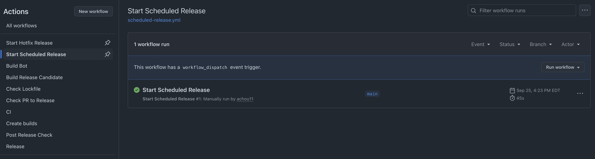

# Releases

## Table of Contents

- [Glossary](#glossary)
- [Background](#background)
- [Common release workflows](#common-release-workflows)
  - [Initiating a scheduled release](#initiating-a-scheduled-release)
  - [Initiating a hotfix release](#initiating-a-hotfix-release)
  - [Manually request a RC build](#manually-request-a-rc-build)
- [Recipes](#recipes)
  - [I want to make a normal change](#i-want-to-make-a-normal-change)
  - [I want a release candidate for a new QA process (release from `main`)](#i-want-a-release-candidate-for-a-new-qa-process-release-from-develop)
  - [I want to add fixes to the release candidate](#i-want-to-add-fixes-to-the-release-candidate)
  - [I want to create a new RC build from an active RC pull request](#i-want-to-create-a-new-rc-build-from-an-active-rc-pull-request)
  - [The RC is ready for release!](#the-rc-is-ready-for-release)
  - [I want to fix a bug in a released version! (hotfix)](#i-want-to-fix-a-bug-in-a-released-version-hotfix)
  - [I want to release the hotfix!](#i-want-to-release-the-hotfix)
  - [I want to review anthing that was not cherry-picked in the RC branch](#i-want-to-review-anthing-that-was-not-cherry-picked-in-the-rc-branch)

## Glossary:

- `RC`: abbreviation for `Release Candidate`.

- `release version`: refers to a truncated variant of a [SemVer](https://semver.org/) version. It has a format of `<minor>.<patch>` e.g. if the `version` field in a `package.json` file is `1.2.0`, then the release version is `2.0`. This is done with the intention of simplifying communication with non-developers about app versions. In practice, we will likely never bump the app to a new major version, so only the minor and patch versions are relevant to communicate.

- `RC branch`: refers to any git branch with a name of the format `rc/**`.

- `release branch`: refers to any git branch with a name of the format `release/**`.

- `scheduled release`: a regular release derived from the `main` branch that may introduce various bug fixes or features.

- `hotfix release`: a release that is mostly intended to fix issues related to a specific scheduled release.

## Background

The [`main`](https://github.com/digidem/comapeo-desktop/tree/main) branch serves as the default branch. The `version` field found in the root [`package.json`](../package.json) will always be one `minor` version ahead of the released version and have the suffix `-pre`. (eg, if the latest released version is `1.2.0`, the `main` branch version will be `1.3.0-pre`).

Builds that are used for testing and distribution are built on GitHub Actions. Public releases can be found in the [repository's releases page](https://github.com/digidem/comapeo-desktop/releases). There are a few different kinds of builds that have different purposes in the app release cycle:

- Internal: an app build that is meant to be used for internal testing with no intention of publicly releasing. This is most often used for receiving early feedback on features or fixes before they are ready for QA. Usually these builds will be based on open pull requests.

- Release Candidate: an app build that is used for internal testing and QA. It reflects the next public release and should be extensively tested.

- Production: an app build that is submitted to the Google Play store for distribution. A production build should have been extensively tested and reflects the changes that exist on the corresponding release branch.

We use manual dispatches from GitHub actions to initiate and coordinate releases (see [Common release workflows](#common-release-workflows) for more details).

## Common release workflows

Releases are conducted via GitHub Actions using manually triggered workflow dispatches. Certain workflows will trigger builds to be created on Expo App Services, which then require a manual submission to the relevant distribution channel(s) afterwards.

### Initiating a scheduled release

1. Go to the [repo's actions page](https://github.com/digidem/comapeo-desktop/actions).

2. Press the `Start Scheduled Release` button.

   

3. Press the `Run workflow` dropdown. It should already specify `main` as the default branch to use, which is what is desired in most cases.

   

4. Run the workflow. This will create a RC pull request that targets a release branch with the next scheduled version and separately bumps the version on the `main` branch to prepare to the next scheduled release (whenever that may be).

### Initiating a hotfix release

1. Go to the [repo's actions page](https://github.com/digidem/comapeo-desktop/actions).

2. Press the `Start Hotfix Release` button.

   

3. Press the `Run workflow` dropdown. It should already specify `main` as the default branch to use, which is what is desired in most cases. It will also require you to specify a version to hotfix. This should be the first component of the relevant release version you want to hotfix. For example, if the release version is `2.0`, you should specify `2`.

   

4. Run the workflow. This will create a RC pull request that targets the relevant release version branch based on the input you provided in the dispatch.

### Manually request a RC build

We have a workflow that checks if a comment on a RC pull request contains special text that indicates a request for a new RC build to be created on EAS. You can either specify a [repo variable](https://github.com/digidem/comapeo-desktop/settings/variables/actions) called `BUILD_COMMENT_TRIGGER` or use the default special text, `/build-rc`. The Release Bot will create another comment on the same PR that provides the URL where the generated builds can be downloaded from. Note that it will take a few minutes for the RC build to actually be available.

## Recipes

### I want to make a normal change!

Make pull requests against `main`. Once merged, it will go into the next release as usual.

### I want a release candidate for a new QA process (release from `main`)

Follow the instructions for [initiating a scheduled release](#initiating-a-scheduled-release).

### I want to add fixes to the release candidate

A release candidate is out and you want to add some changes and make a new RC build for testing.

1. Make any fixes on `main` as normal.

2. `git checkout rc/v2.0 && git pull`: check out the relevant RC branch and make sure you're up to date. Note that `2.0` is just an example here. You should replace this with the appropriate version.

3. `git checkout -b fix-some-issue`: create a new branch from the RC branch. Ideally, do not prefix the branch the name of the RC branch (e.g. `rc/v2.0/fix-some-issue`), as that will likely trigger workflows that match against the branch name.

4. `git cherry-pick abc1234`: cherry pick commit(s) with fixes from `main`.

5. `git push`: push changes to remote

6. `gh pr create --base rc/v2.0`: create a pull request against the RC branch. Alternatively can use the GitHub UI to create the pull request.

7. Review the pull request and merge into the RC branch when ready.

### I want to create a new RC build from an active RC pull request

Follow the instructions for [manually requesting a RC build](#manually-request-a-rc-build).

### The RC is ready for release!

1. Make sure the RC pull request is passing checks and has required reviews

2. Merge the RC pull request into the release branch via the GitHub UI. Note that the pull request should use the `Merge` strategy and NOT the `Squash and merge` or `Rebase and merge` options. This is so that the commit history is preserved on the targeted release branch, which makes it easier to refer to for debugging or hotfixes.

### I want to fix a bug in a released version! (hotfix)

Release `v2.0` is out, and there is a fix in develop that was not in the release that we’ve decided cannot wait until the next release. Follow the instructions for [initiating a hotfix release](#initiating-a-hotfix-release). In this example, the release version to use for the input would be `2`.

### I want to release the hotfix!

1. Ensure checks are passing on the hotfix RC pull request and that required reviewers approve.

2. Merge the hotfix pull request into the relevant release branch (`release/v2.x` in this example).

### I want to review anthing that was not cherry-picked in the RC branch

`git cherry -v develop rc/v1.0 | grep '^+'` (replace `1.0` with the relevant version)
